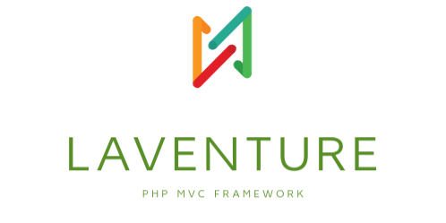

<p align="center">
<a href="https://laventure.ru" target="_blank">
 
</a>
</p>

<p align="center">
<a href="https://packagist.org/packages/laventure/framework">
  
</a>
<a href="https://packagist.org/packages/laventure/framework">
  
</a>
<a href="https://packagist.org/packages/laventure/framework">
    
</a>
</p>

### About
[Laventure ]() is a **PHP framework** for web and console applications and a set of reusable **components**.
For the moment it is used for simple web application.


### Installation
```
composer require laventure/framework
```


### Analyse code
- https://phpstan.org/user-guide/getting-started
```bash
./vendor/bin/phpstan analyse src tests
```


### Testing
- https://phpunit.de/
```bash
./vendor/bin/phpunit tests
```


### Documentation 

**[1. Introduction](docs/introduction/readme.md)**

**[2. Components](docs/components)**
* [1.1. Filesystem](docs/components/filesystem/readme.php)
* [1.2. Config](docs/components/config/readme.php)
* [1.3. Container](docs/components/container/readme.php)
* [1.4. Routing](docs/components/routing/readme.php)
* [1.5. HTTP](docs/components/http/readme.php)
* [1.6. Validation](docs/components/validation/readme.php)
* [1.7. Database](docs/components/database/readme.php)
* [1.8. Caching](docs/components/caching/readme.php)
* [1.9. Security](docs/components/security/readme.php)
* [1.10. Event](docs/components/event/readme.php)
* [1.11. Debug](docs/components/debug/readme.php)
* [1.12. Templating](docs/components/templating/readme.php)
* [1.13. Console](docs/components/console/readme.php)


### Author
- Telegram: @me
- Github: @github

### Contributing
```
No contribution
```


### Licence
Copyright &copy; 2024 Jean-Claude
This project is [MIT](LICENSE) licensed


